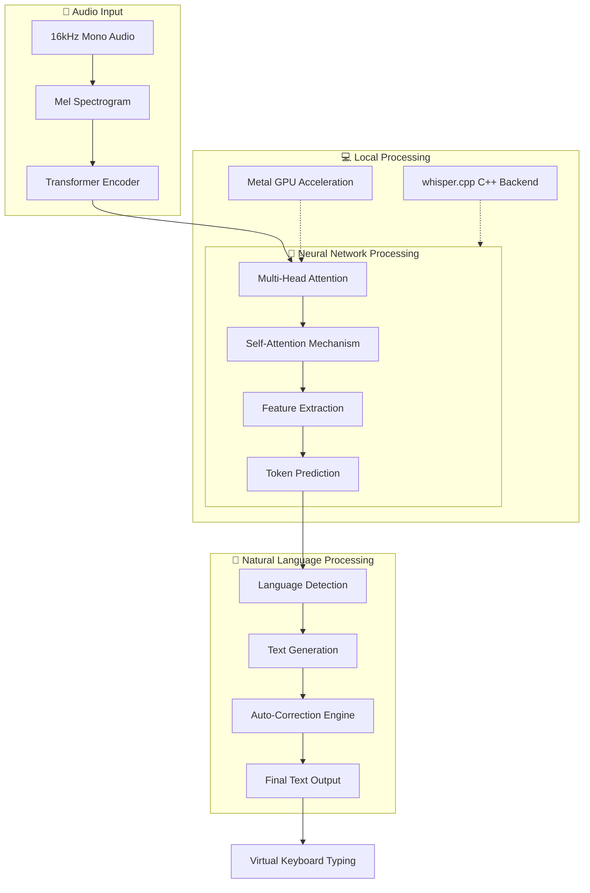

# 🎤 Jarvis Voice

A minimalistic, high-performance **AI-powered speech-to-text** app for macOS using **OpenAI Whisper** neural network with local processing.

## 🤖 AI & Neural Network Architecture

Jarvis Voice leverages **OpenAI Whisper**, a state-of-the-art **neural network** specifically designed for **Automatic Speech Recognition (ASR)** and **Natural Language Processing (NLP)**.

### What is Whisper?

Whisper is a **deep learning model** (transformer-based neural network) trained on 680,000 hours of multilingual audio data. It performs multiple **NLP tasks** simultaneously:

- 🎯 **Speech Recognition** - Converts audio to text with high accuracy
- 🌍 **Language Identification** - Auto-detects 99 languages 
- 📝 **Transcription** - Handles accents, background noise, and technical vocabulary
- 🔄 **Translation** - Can transcribe and translate in real-time

### Model Architecture



### Why Local AI?

✅ **Privacy** - Your voice never leaves your Mac  
✅ **Speed** - ~1.5-2x real-time transcription on Apple Silicon  
✅ **Offline** - Works without internet  
✅ **Customizable** - Choose from 5 model sizes based on accuracy needs

## ✨ Features

- 🎯 **Right Option Key** - Press and hold to record (up to 90 seconds)
- 🔊 **Dual Audio Feedback** - Choose separate notification sounds for start AND stop
- 📝 **Auto-Corrections** - Teach the AI your custom words and phrases
- 🧠 **Smart NLP** - Handles accents, background noise, technical terms
- 💻 **Focus Restoration** - Returns to your previous app before typing
- 🔒 **100% Local** - Neural network runs on your Mac (Metal GPU)
- ⚡ **Fast** - Real-time transcription with Metal acceleration
- 🎨 **Menu Bar App** - Clean interface with 14 notification sounds for each event
- 🌍 **Multi-language** - Supports 99 languages via AI language detection

## 🚀 Performance

| Metric | Value |
|--------|-------|
| **AI Model** | OpenAI Whisper (Transformer) |
| **Backend** | whisper.cpp (C++/Metal) |
| **Latency** | ~128ms (imperceptible) |
| **Speed** | 1.5-2x real-time |
| **Memory** | Capped at ~7.5MB (90s max) |
| **Languages** | 99 supported |
| **Processing** | 100% Local (Apple Silicon GPU) |

## 📦 Installation

### Prerequisites
- macOS 10.15+ (Intel or Apple Silicon)
- Python 3.10+
- Microphone access

### Quick Install

```bash
cd ~/Applications/JarvisVoice
pip install -r requirements.txt
```

### System Dependencies

```bash
brew install portaudio ffmpeg
```

**Note:** The Whisper model (~150MB for base) downloads automatically on first run.

## 🎮 Usage

### Start the App

```bash
jarvis
```

Or manually:
```bash
cd ~/Applications/JarvisVoice
python src/main.py
```

### How to Use

1. **Hold Right Option key** 🔊 (hear notification sound - recording starts)
2. **Speak naturally** - The AI transcribes your speech using neural network processing
3. **Release key** 🔊 (hear notification sound - recording stops)
4. **Text appears** automatically in your active application ✨

**Max recording time:** 90 seconds

## ⚙️ AI Model Configuration

Edit `~/.jarvisvoice/config.json`:

```json
{
  "model_size": "base",
  "language": "en",
  "auto_paste": true,
  "recording_sound_start": "Ping",
  "recording_sound_end": "Ping"
}
```

### Available Neural Network Models

| Model | Size | Accuracy | Speed | Best For |
|-------|------|----------|-------|----------|
| `tiny` | ~39MB | ⭐⭐ Basic | ⚡⚡⚡ Fastest | Testing |
| `base` | ~150MB | ⭐⭐⭐ Good | ⚡⚡ Fast | **Daily Use** ⭐ |
| `small` | ~466MB | ⭐⭐⭐⭐ Better | ⚡ Medium | Accuracy priority |
| `medium` | ~1.5GB | ⭐⭐⭐⭐⭐ High | 🐢 Slower | Professional |
| `large-v3` | ~3GB | ⭐⭐⭐⭐⭐ Best | 🐢🐢 Slowest | Maximum accuracy |

### Notification Sounds

Choose **separate sounds** for start and end of recording from 14 macOS system sounds:
- **Ping** (default) - Clean, high-pitched
- **Tink** - Light metallic tap  
- **Pop** - Bubble pop
- **Glass** - Gentle tap
- **Hero** - Triumphant fanfare
- ...and 9 more!

**Access via:**
- 🎤 Menu → 🔔 **Start Sound** - Sound when recording begins
- 🎤 Menu → 🔕 **End Sound** - Sound when recording stops

*Example: Use "Ping" for start and "Pop" for end to easily distinguish them!*

## 📝 Auto-Corrections (NLP Enhancement)

Teach the AI model your vocabulary:

1. Click 🎤 → 📝 Add Correction
2. Enter what you said (e.g., "jarves")
3. Enter correct spelling (e.g., "Jarvis")
4. Future transcriptions automatically apply corrections!

The AI learns and adapts using pattern matching with regex.

## 🔧 Technical Stack

- **AI Model:** OpenAI Whisper (Transformer Neural Network)
- **Backend:** whisper.cpp (C++ implementation)
- **Acceleration:** Apple Metal GPU (M1/M2/M3)
- **Audio:** sounddevice (PortAudio)
- **UI:** rumps (native macOS menu bar)
- **Input:** pynput (global hotkeys)
- **Output:** pynput (virtual keyboard)

## 🛠️ Troubleshooting

### "Microphone access denied"
System Preferences → Security & Privacy → Privacy → Microphone → Add Terminal

### "Model not loading"
- First run downloads the neural network (~150MB)
- Check internet connection for initial download

### Recording not working
- Check microphone is default input: System Preferences → Sound → Input
- Ensure no other app is using the microphone

## 📄 License

MIT License

---

**Powered by OpenAI Whisper Neural Network** 🧠✨  
*Local AI. Private. Fast. Accurate.*