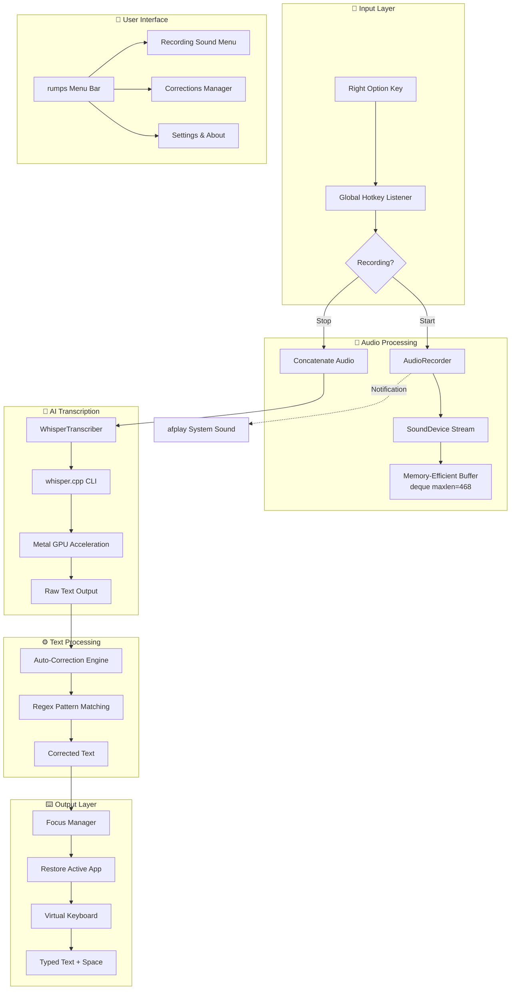
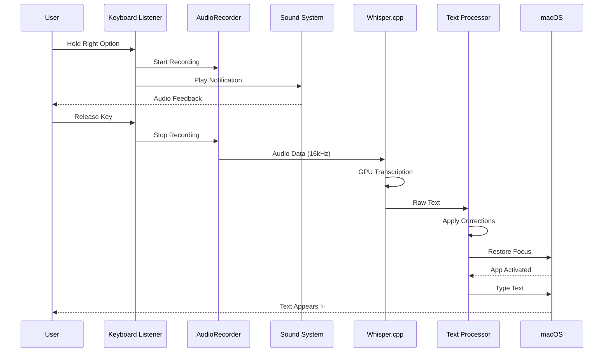

# 🎤 Jarvis Voice

A minimalistic, high-performance local speech-to-text app for macOS powered by OpenAI Whisper with Metal GPU acceleration.

## ✨ Features

- 🎯 **Right Option Key** - Press and hold to record, release to transcribe
- 🔊 **Audio Feedback** - Choose from 14 notification sounds to indicate recording start
- 📝 **Auto-Corrections** - Teach the app your custom words and phrases
- 💻 **Smart Typing** - Automatically restores focus to your previous app before typing
- 🔒 **100% Local** - Uses Whisper.cpp with Metal GPU, no internet required
- ⚡ **Fast Performance** - ~1.5-2x real-time transcription on Apple Silicon
- 🎨 **Menu Bar App** - Clean interface with easy access to all settings
- 🧠 **Memory Safe** - Auto-limits recording to 60 seconds max
- 🌍 **Multi-language** - Supports 99 languages

## 🏗️ Architecture



## 📊 Data Flow



## 🚀 Performance

| Metric | Value |
|--------|-------|
| Recording Latency | ~128ms (imperceptible) |
| Memory Usage | Capped at ~5MB (60s max) |
| Transcription Speed | 1.5-2x real-time (Apple Silicon) |
| Total Pipeline | 2-4 seconds for 5s speech |
| CPU Usage | Minimal during recording |

## 📋 Requirements

- macOS 10.15+ (Intel or Apple Silicon)
- Python 3.10+
- Microphone access
- Accessibility permissions (for typing)

## 🛠️ Installation

### Quick Install

```bash
cd ~/Applications/JarvisVoice
./setup.sh
```

### Manual Install

1. **Install system dependencies:**
```bash
brew install portaudio ffmpeg
```

2. **Install Python dependencies:**
```bash
pip install -r requirements.txt
```

3. **Download Whisper model:**
Models download automatically on first run (~150MB for base model).

## 🎮 Usage

### Start the app:
```bash
jarvis
```

Or manually:
```bash
cd ~/Applications/JarvisVoice
python src/main.py
```

### How to use:
1. **Hold Right Option key** 🔊 hear notification sound
2. **Speak clearly** - unlimited duration (60s max)
3. **Release key** - transcription starts automatically
4. **Text appears** in your active application ✨

## ⚙️ Configuration

Edit `~/.jarvisvoice/config.json`:

```json
{
  "hotkey": "ctrl",
  "model_size": "base",
  "language": "en",
  "auto_paste": true,
  "recording_sound": "Ping"
}
```

### Available Models:
| Model | Size | Speed | Accuracy | Best For |
|-------|------|-------|----------|----------|
| `tiny` | ~39MB | ⚡⚡⚡ Fastest | ⭐⭐ Basic | Testing, quick notes |
| `base` | ~150MB | ⚡⚡ Fast | ⭐⭐⭐ Good | Daily use ⭐ **Recommended** |
| `small` | ~466MB | ⚡ Medium | ⭐⭐⭐⭐ Better | Accuracy priority |
| `medium` | ~1.5GB | 🐢 Slower | ⭐⭐⭐⭐⭐ High | Professional use |
| `large-v3` | ~3GB | 🐢🐢 Slowest | ⭐⭐⭐⭐⭐ Best | Maximum accuracy |

### Notification Sounds (14 options):
- **Ping** - Clean, high-pitched (default)
- **Tink** - Light metallic tap
- **Pop** - Bubble pop sound
- **Glass** - Gentle glass tap
- **Hero** - Triumphant fanfare
- ...and 9 more!

Access via menu: 🎤 → 🔔 Recording Sound

## 📝 Auto-Corrections

Teach Jarvis your custom words:

1. Click 🎤 menu → 📝 Add Correction
2. Enter what the app heard (e.g., "jarves")
3. Enter what you meant (e.g., "Jarvis")
4. Future transcriptions automatically correct!

### Manage corrections:
- 📚 View Corrections - See all saved corrections
- 🗑️ Delete Correction - Remove unwanted corrections

## 🛠️ Troubleshooting

### "Microphone access denied"
1. **System Preferences** → **Security & Privacy** → **Privacy** → **Microphone**
2. Add your terminal app (Terminal/iTerm)
3. Restart Jarvis Voice

### "Accessibility permission required"
1. **System Preferences** → **Security & Privacy** → **Privacy** → **Accessibility**
2. Add your terminal app
3. Restart Jarvis Voice

### Recording not working
- Check microphone is set as default input: **System Preferences** → **Sound** → **Input**
- Ensure no other app is using the microphone

### Model not loading
- First run downloads the model (~150MB)
- Check internet connection for initial download
- Verify `~/.jarvisvoice/` directory exists

## 📁 File Structure

```
JarvisVoice/
├── src/
│   ├── main.py                 # Main application (~430 lines)
│   └── main_working.py         # Backup version
├── whisper_cpp_wrapper.py      # Whisper.cpp integration
├── requirements.txt            # Python dependencies
├── setup.sh                    # Installation script
├── start.sh                    # Launcher script
├── launch.sh                   # Alternative launcher
├── diagnostic.sh               # Diagnostic tool
├── fix-permissions.sh          # Permission fixer
├── uninstall.sh                # Uninstall script
└── README.md                   # This file
```

## 🔧 Technical Details

### Audio Pipeline
- **Sample Rate:** 16,000 Hz (optimal for Whisper)
- **Channels:** Mono (1 channel)
- **Format:** 32-bit float (native)
- **Blocksize:** 2048 samples (~128ms latency)
- **Buffer:** Memory-capped deque (max 60 seconds)

### AI/ML Stack
- **Engine:** whisper.cpp (C++ implementation)
- **Acceleration:** Apple Metal GPU (M1/M2/M3)
- **Wrapper:** Python subprocess call
- **Languages:** 99 supported (ISO 639-1)

### UI Framework
- **Menu Bar:** rumps (native macOS)
- **Notifications:** macOS native notifications
- **Sounds:** macOS system sounds via `afplay`

### Dependencies
- `rumps` - Menu bar app framework
- `sounddevice` - Audio recording (PortAudio)
- `numpy` - Audio processing
- `pynput` - Global hotkeys & typing
- `soundfile` - WAV file handling

## 🎯 Optimizations

The app has been heavily optimized:

- ✅ **Removed Qt GUI** - No more visual indicator (using audio instead)
- ✅ **Eliminated 60fps timer** - Saved CPU cycles
- ✅ **Memory-safe buffer** - Auto-limits to 60s max
- ✅ **Non-blocking operations** - Async app detection
- ✅ **Efficient audio concat** - Single operation
- ✅ **Dictionary lookups** - O(1) for sound descriptions
- ✅ **Reduced from 1008 to ~430 lines** - 57% smaller codebase

## 🤝 Credits

- **Whisper** by OpenAI - Speech recognition model
- **whisper.cpp** by ggerganov - Fast C++ implementation
- **rumps** by jaredks - macOS menu bar apps
- **Inspired by** Aqua Voice - The original fluid voice interface

## 📄 License

MIT License - Feel free to use, modify, and distribute!

---

**Made with ❤️ for macOS users who love efficiency**